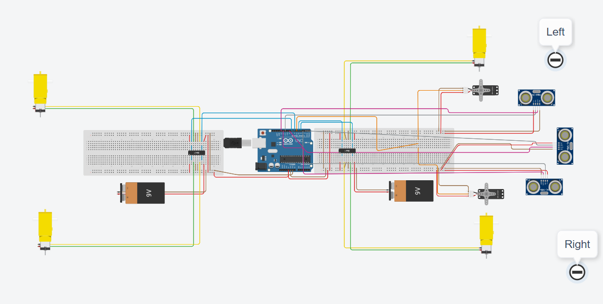

Certainly! Below is a sample README.md file for your Arduino-based Smart Stick project on GitHub:

# Arduino Smart Stick with Collision Avoidance

This Arduino-based Smart Stick is designed to help users avoid collisions by measuring distance on all three sides using ultrasonic distance sensors and turning the front wheels based on that information using servo motors. The project also utilizes four Hobby Gearmotors powered by two 9V batteries and coordinated with motor drivers.

## Table of Contents

- [Introduction](#introduction)
- [Hardware Requirements](#hardware-requirements)
- [Software Requirements](#software-requirements)
- [Assembly Instructions](#assembly-instructions)
- [Arduino Code](#arduino-code)
- [Usage](#usage)
- [Contributing](#contributing)
- [License](#license)

## Introduction

The Arduino Smart Stick is a versatile device that can be used by individuals with visual impairments or as an aid for navigating in crowded or unfamiliar environments. It uses ultrasonic distance sensors to detect obstacles in front, left, and right directions and adjusts the position of the front wheels to avoid collisions. The four Hobby Gearmotors provide locomotion control for the device.

## Hardware Requirements

- Arduino board (e.g., Arduino Uno)
- Ultrasonic distance sensors (3x)
- Servo motors (2x)
- Hobby Gearmotors (4x)
- Motor drivers (e.g., L298N)
- 9V batteries (2x)
- Chassis, wheels, and frame components
- Jumper wires and connectors
- Breadboard (optional)

## Software Requirements

- Arduino IDE (https://www.arduino.cc/en/software)
- Arduino libraries for ultrasonic sensors and servo motors

## Assembly Instructions

1. Assemble the chassis, wheels, and frame components to create the Smart Stick's physical structure.
2. Mount the ultrasonic distance sensors on the front, left, and right sides of the chassis.
3. Connect the ultrasonic sensors to the Arduino board using jumper wires. Refer to the pinout specified in your Arduino code.
4. Attach the servo motors to control the front wheels, ensuring they can turn left and right smoothly.
5. Connect the servo motors to the Arduino board.
6. Connect the Hobby Gearmotors to the motor drivers and power them with the 9V batteries.
7. Mount the motor drivers on the chassis and connect them to the Arduino board.
8. Double-check all connections and power sources.
9. Load the Arduino code onto your Arduino board (see below).

## Arduino Code

Upload the provided Arduino code to your Arduino board using the Arduino IDE. Ensure that you have installed the necessary libraries for the ultrasonic sensors and servo motors. You can find the code in the [Arduino Code](Code.ino) directory of this repository.

## Usage

1. Power on the Arduino board and the motor drivers.
2. The Smart Stick will start measuring distances using the ultrasonic sensors.
3. When an obstacle is detected, the front wheels will turn in the opposite direction to avoid the collision.
4. You can further customize the behavior and sensitivity of the Smart Stick by modifying the Arduino code.

## Further Scopes of Improvement
1. We can implement ML in it to map surroundings allowing better navigation
2. We can connect it to GPS and Google Maps API that enables it to guide the individual to a destination

---

Feel free to customize this README.md file to match the specifics of your project and provide more detailed information, code examples, and images as needed.
